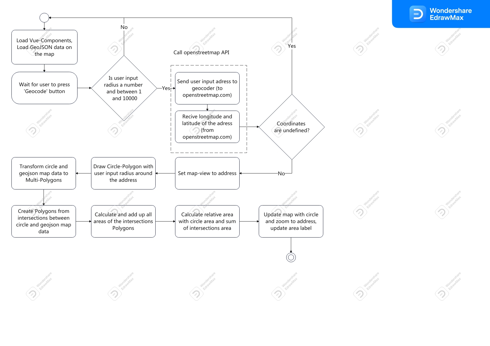

# leafy_home

## Development Documentation

The opening question for this project is: ' How much park area are in my surronding area to enjoy the nature in the city?'
Requierements that the project should fullfill are:
* Show all park area of the city Hamburg on a map
* Users can input a address and a radius
* Circle will drawn on the map to show the included calculated area 
* Map zoom onto to the circle with the given radius around the given address
* Calculate and display the relative area of park areas with two digits after the comma

The data of the official park areas of the city Hamburg is provided by 'Freie und Hansestadt Hamburg, Behörde für Umwelt und Energie'.

In the picture below a UML activity diagram is shown. At first the vue components and map with the park area GeoJSOn data will load. 
The programm will wait until a user push the 'Geocode' button and then check for valid radius input. After geocoding the user input 
radius will be checked if it's type number and if it's between 1 and 10000. Proceeding after checks are valid, the openstreetmap API
(url is: https://nominatim.openstreetmap.org/) will be called and geocode the given address to longitude and latitude. Another check 
for valid coordinition will follow. If one checks should fail, the site will reload.



## Usage

For now, it's only working properly for the city Hamburg, Germany. 
Type the address and the radius into the input fields and after clicking the `Geocode` button within a few
seconds the realtive area of public park area inside the circle will be calculated. 
The green yields are the public park area, the blue circle show the area with the radius around the adress.
The address needs only to be the streetname and the number.
The radius will be calculated in meter.

This picture show the default site after starting/opening the webiste


An example how this webiste work, the esample address is Rathausmarkt 1 in Hamburg the radius is given with 1000 meter


## Further Development

For now, this map only works for Hamburg, Germany. It also show only the official park areas from the city exluded forrest or unofficial park areas in the city.
Furthermore the calculating time is long. Main points for further development should be:
* All green areas in the city should be included on the map e.g. forrest
* All possible places in Germany, which have published the data should be included
* Calucaltion time should be reduced

## Project setup
```
npm install
```

### Compiles and hot-reloads for development
```
npm run serve
```

### Compiles and minifies for production
```
npm run build
```

### Lints and fixes files
```
npm run lint
```

### Customize configuration
See [Configuration Reference](https://cli.vuejs.org/config/).
